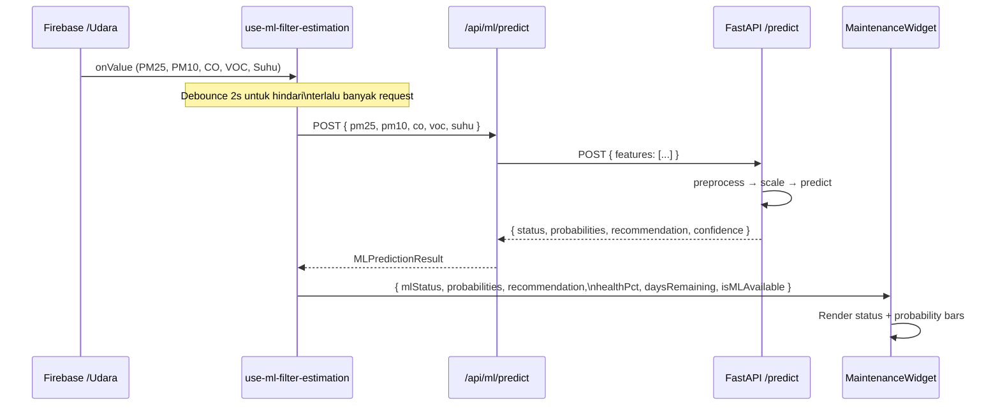

# Design Document: ML Filter Estimation Integration

## Overview

Fitur ini mengintegrasikan pipeline Machine Learning (Python) untuk estimasi pergantian filter udara ke dalam project Next.js yang sudah ada. Pipeline ML menggunakan model Random Forest/Decision Tree/SVM yang dilatih dengan data sensor (PM2.5, PM10, CO, VOC, Suhu) untuk mengklasifikasikan kondisi filter menjadi tiga status: **Aman**, **Perhatian**, dan **Ganti Filter** — menggantikan logika rule-based sederhana yang ada di `hooks/use-filter-estimation.ts` dengan prediksi berbasis probabilitas yang lebih akurat.

Pendekatan integrasi yang dipilih adalah **Python FastAPI Microservice** yang meng-host model `.pkl`, dipanggil dari Next.js melalui Next.js API Route sebagai proxy. Pendekatan ini mempertahankan ekosistem Python untuk ML (scikit-learn, joblib) tanpa perlu konversi model, sekaligus menjaga keamanan dengan tidak mengekspos endpoint Python langsung ke browser.

---

## Architecture

### Pendekatan Integrasi: Python FastAPI + Next.js API Route Proxy

Dari tiga opsi yang ada, **Python FastAPI** dipilih karena:

- Model `.pkl` scikit-learn tidak perlu dikonversi (ONNX conversion bisa lossy untuk ensemble models)
- Logika threshold rule-based yang ada sudah cukup akurat — ML menambahkan probabilitas per kelas dan confidence score
- Next.js API Route sebagai proxy menjaga CORS dan keamanan API key
- Dapat di-deploy terpisah (Railway, Render, atau co-located dengan Docker Compose)

```mermaid
graph TD
    subgraph "Firebase Realtime Database"
        FB_UDARA["/Udara\nPM25, PM10, CO, VOC, Suhu"]
        FB_HISTORY["/history\ntimestamped readings"]
        FB_CMD["/Command\nfilterStartDate"]
    end

    subgraph "Next.js App (Browser)"
        HOOK_SENSOR[use-sensor-data.ts\nreal-time sensor hook]
        HOOK_ML[use-ml-filter-estimation.ts\nNEW: ML prediction hook]
        HOOK_OLD[use-filter-estimation.ts\nEXISTING: rule-based hook]
        WIDGET[maintenance-widget.tsx\nENHANCED: shows ML results]
        DASHBOARD[dashboard.tsx]
    end

    subgraph "Next.js API Routes (Server)"
        API_PREDICT[/api/ml/predict\nPOST - proxy to Python]
        API_HEALTH[/api/ml/health\nGET - check Python service]
    end

    subgraph "Python FastAPI Service"
        PY_ENDPOINT[POST /predict\naccepts sensor JSON]
        PY_MODEL[ModelLoader\nloads .pkl on startup]
        PY_PREPROCESS[Preprocessor\nscaler + feature engineering]
        PY_RF[Random Forest / Best Model\n.pkl file]
    end

    FB_UDARA -->|onValue listener| HOOK_SENSOR
    FB_HISTORY -->|getHistoricalData| HOOK_ML
    FB_CMD -->|listenToFilterStartDate| HOOK_OLD

    HOOK_SENSOR --> HOOK_ML
    HOOK_SENSOR --> DASHBOARD
    HOOK_ML --> WIDGET
    HOOK_OLD --> WIDGET

    DASHBOARD --> WIDGET

    HOOK_ML -->|fetch POST| API_PREDICT
    API_PREDICT -->|HTTP POST| PY_ENDPOINT
    PY_ENDPOINT --> PY_PREPROCESS
    PY_PREPROCESS --> PY_MODEL
    PY_MODEL --> PY_RF
    PY_RF -->|prediction + probabilities| PY_ENDPOINT
    PY_ENDPOINT -->|JSON response| API_PREDICT
    API_PREDICT -->|JSON response| HOOK_ML

    API_HEALTH -->|GET /health| PY_ENDPOINT
```

### Data Flow Lengkap



---

## Components and Interfaces

### Component 1: `use-ml-filter-estimation.ts` (Hook Baru)

**Purpose**: Hook utama yang menggabungkan prediksi ML dengan estimasi lifespan filter yang sudah ada. Menggantikan `use-filter-estimation.ts` sebagai sumber data untuk `MaintenanceWidget`.

**Interface**:

```typescript
interface MLFilterEstimationResult {
  // Dari ML model
  mlStatus: FilterStatus | null; // "Aman" | "Perhatian" | "Ganti Filter" | null
  probabilities: FilterProbabilities | null;
  recommendation: string | null;
  confidence: number | null; // 0-1, probabilitas kelas tertinggi
  isMLAvailable: boolean; // false jika Python service down

  // Dari rule-based (fallback + lifespan)
  healthPct: number; // 0-100, dari use-filter-estimation logic
  daysRemaining: number;
  ruleBasedStatus: FilterStatus; // selalu tersedia sebagai fallback

  // State
  isLoading: boolean;
  isPredicting: boolean; // true saat menunggu ML response
  error: string | null;
  resetFilter: () => Promise<void>;
}
```

**Responsibilities**:

- Subscribe ke sensor data real-time dari Firebase via `useSensorData`
- Debounce panggilan ke ML API (2 detik) untuk menghindari request berlebihan
- Fallback ke rule-based status jika ML service tidak tersedia
- Menggabungkan `healthPct` dan `daysRemaining` dari logika existing dengan status ML

---

### Component 2: `/api/ml/predict` (Next.js API Route)

**Purpose**: Proxy server-side antara Next.js dan Python FastAPI. Menyembunyikan URL Python service dari browser.

**Interface**:

```typescript
// POST /api/ml/predict
interface PredictRequest {
  pm25: number;
  pm10: number;
  co: number;
  voc: number;
  suhu: number;
}

interface PredictResponse {
  status: FilterStatus;
  probabilities: FilterProbabilities;
  recommendation: string;
  confidence: number;
  model_used: string; // "random_forest" | "decision_tree" | "svm"
  latency_ms: number;
}
```

**Responsibilities**:

- Validasi input sebelum dikirim ke Python
- Forward request ke `PYTHON_ML_SERVICE_URL` (env variable)
- Handle timeout (5 detik) dan error dari Python service
- Return 503 jika Python service tidak tersedia (bukan 500)

---

### Component 3: `MaintenanceWidget` (Enhanced)

**Purpose**: Komponen UI yang sudah ada, diperluas untuk menampilkan hasil prediksi ML.

**Props Baru**:

```typescript
interface MaintenanceWidgetProps {
  // Props existing (tidak berubah)
  filterHealth?: number;
  daysRemaining?: number;
  onResetFilter?: () => void;
  isLoading?: boolean;
  currentPm25?: number;
  temperature?: number;
  batteryLevel?: number;

  // Props baru untuk ML
  mlStatus?: FilterStatus | null;
  probabilities?: FilterProbabilities | null;
  recommendation?: string | null;
  confidence?: number | null;
  isMLAvailable?: boolean;
  isPredicting?: boolean;
}
```

**Responsibilities**:

- Tampilkan ML status badge di samping status existing
- Tampilkan probability bars untuk tiga kelas (Aman/Perhatian/Ganti Filter)
- Tampilkan recommendation text dari ML
- Graceful degradation: jika `isMLAvailable = false`, sembunyikan ML section
- Loading skeleton saat `isPredicting = true`

---

### Component 4: Python FastAPI Service

**Purpose**: Microservice Python yang meng-host model `.pkl` dan melayani prediksi.

**Interface**:

```python
# POST /predict
class PredictRequest(BaseModel):
    pm25: float
    pm10: float
    co: float
    voc: float
    suhu: float

class PredictResponse(BaseModel):
    status: str           # "Aman" | "Perhatian" | "Ganti Filter"
    probabilities: dict   # {"Aman": 0.1, "Perhatian": 0.3, "Ganti Filter": 0.6}
    recommendation: str
    confidence: float
    model_used: str
    latency_ms: float
```

---

## Data Models

### `FilterStatus`

```typescript
type FilterStatus = "Aman" | "Perhatian" | "Ganti Filter";
```

**Mapping ke UI**:

- `"Aman"` → emerald theme, CheckCircle2 icon
- `"Perhatian"` → orange theme, AlertCircle icon
- `"Ganti Filter"` → red theme, Wrench icon

---

### `FilterProbabilities`

```typescript
interface FilterProbabilities {
  aman: number; // 0-1
  perhatian: number; // 0-1
  gantiFilter: number; // 0-1
  // Invariant: aman + perhatian + gantiFilter ≈ 1.0
}
```

---

### `MLPredictionResult`

```typescript
interface MLPredictionResult {
  status: FilterStatus;
  probabilities: FilterProbabilities;
  recommendation: string;
  confidence: number;
  modelUsed: string;
  latencyMs: number;
  predictedAt: Date;
}
```

---

### `SensorFeatures` (Input ke ML)

```typescript
interface SensorFeatures {
  pm25: number; // μg/m³
  pm10: number; // μg/m³
  co: number; // ppm
  voc: number; // ppm
  suhu: number; // °C
}
```

Mapping dari `SensorReading` yang sudah ada:

```typescript
const features: SensorFeatures = {
  pm25: sensorData.pm25,
  pm10: sensorData.pm10,
  co: sensorData.co,
  voc: sensorData.voc,
  suhu: sensorData.suhu,
};
```

---

## Error Handling

### Error Scenario 1: Python Service Tidak Tersedia

**Kondisi**: Python FastAPI service down, timeout, atau network error  
**Response**: API Route `/api/ml/predict` mengembalikan HTTP 503  
**Recovery**: Hook set `isMLAvailable = false`, tampilkan rule-based status sebagai fallback. Widget menyembunyikan ML section dan menampilkan badge "ML Offline".

### Error Scenario 2: Input Sensor Invalid

**Kondisi**: Nilai sensor negatif, NaN, atau di luar range fisik yang masuk akal  
**Response**: API Route mengembalikan HTTP 422 dengan detail validasi  
**Recovery**: Hook log error, tidak update state, pertahankan prediksi terakhir yang valid.

### Error Scenario 3: Model File Tidak Ditemukan

**Kondisi**: File `.pkl` tidak ada saat Python service startup  
**Response**: Python service gagal start (exit code non-zero)  
**Recovery**: Deployment pipeline harus memastikan model file tersedia. Service tidak boleh start tanpa model.

### Error Scenario 4: Firebase Sensor Data Kosong

**Kondisi**: Firebase `/Udara` node belum ada atau semua nilai 0  
**Response**: Hook mendeteksi semua nilai 0, skip ML prediction  
**Recovery**: Tampilkan loading state, tunggu data valid dari Firebase.

---

## Testing Strategy

### Unit Testing Approach

- Test `use-ml-filter-estimation` hook dengan mock fetch dan mock Firebase
- Test mapping `SensorReading` → `SensorFeatures` → `MLPredictionResult`
- Test fallback behavior saat `isMLAvailable = false`
- Test debounce logic (tidak boleh kirim request lebih dari 1x per 2 detik)

### Property-Based Testing Approach

**Property Test Library**: fast-check

**Properties yang diuji**:

1. Untuk semua input sensor valid, `probabilities.aman + probabilities.perhatian + probabilities.gantiFilter` selalu ≈ 1.0 (±0.001)
2. `confidence` selalu sama dengan nilai tertinggi dari `probabilities`
3. Jika `status = "Aman"`, maka `probabilities.aman` adalah nilai tertinggi
4. Untuk input yang memenuhi threshold "Ganti Filter" (PM2.5 > 75 OR PM10 > 150 OR CO > 9 OR VOC > 2), rule-based fallback selalu mengembalikan `"Ganti Filter"`

### Integration Testing Approach

- Test end-to-end: Firebase data → hook → API Route → Python service → Widget render
- Test dengan Python service mock (MSW atau jest mock fetch)
- Test graceful degradation saat Python service di-mock untuk return 503

---

## Performance Considerations

- **Debounce 2 detik**: Sensor Firebase update setiap ~3 detik, debounce 2 detik memastikan maksimal 1 ML request per update cycle
- **Cache prediksi terakhir**: Jika sensor values tidak berubah signifikan (delta < 5%), gunakan prediksi cache
- **Timeout 5 detik**: API Route timeout ke Python service setelah 5 detik untuk tidak memblokir UI
- **Python service warm-up**: Model `.pkl` di-load sekali saat startup, bukan per-request
- **Next.js API Route**: Berjalan di server-side, tidak menambah bundle size browser

---

## Security Considerations

- **URL Python service disimpan di env variable** (`PYTHON_ML_SERVICE_URL`) — tidak pernah diekspos ke browser
- **Input validation di API Route**: Semua nilai sensor divalidasi range sebelum dikirim ke Python
- **No authentication untuk internal service**: Python service hanya accessible dari Next.js server (tidak public), bisa ditambahkan shared secret via header jika diperlukan
- **Rate limiting**: Debounce di hook sudah membatasi request, tapi API Route bisa ditambahkan rate limiting jika dibutuhkan

---

## Dependencies

### Next.js Side (tidak ada dependency baru)

- Semua dependency sudah tersedia: React, TypeScript, Firebase SDK, Lucide React

### Python Service (baru)

```
fastapi==0.115.0
uvicorn==0.30.0
scikit-learn==1.5.0
joblib==1.4.0
numpy==1.26.0
pydantic==2.7.0
```

### Environment Variables Baru

```bash
# .env.local
PYTHON_ML_SERVICE_URL=http://localhost:8000   # development
# PYTHON_ML_SERVICE_URL=https://your-ml-service.railway.app  # production
```

---

## Low-Level Design

### Key Functions with Formal Specifications

#### `useMLFilterEstimation()` Hook

```typescript
function useMLFilterEstimation(): MLFilterEstimationResult;
```

**Preconditions:**

- `useSensorData` hook tersedia dan mengembalikan `SensorReading` valid
- `useFilterEstimation` hook tersedia untuk fallback `healthPct` dan `daysRemaining`
- Environment variable `PYTHON_ML_SERVICE_URL` terkonfigurasi (server-side)

**Postconditions:**

- Selalu mengembalikan `healthPct` dan `daysRemaining` (tidak pernah null) dari logika existing
- `mlStatus` bisa null jika `isMLAvailable = false` atau belum ada prediksi
- `ruleBasedStatus` selalu tersedia sebagai fallback
- `isPredicting` menjadi `false` setelah response diterima atau timeout

**Loop Invariants (debounce effect):**

- Setiap kali sensor data berubah, timer debounce di-reset
- Request ML hanya dikirim setelah 2 detik tanpa perubahan sensor

---

#### `predictFilterStatus(features: SensorFeatures): Promise<MLPredictionResult>`

```typescript
async function predictFilterStatus(
  features: SensorFeatures,
): Promise<MLPredictionResult>;
```

**Preconditions:**

- `features.pm25 >= 0 && features.pm25 <= 1000`
- `features.pm10 >= 0 && features.pm10 <= 2000`
- `features.co >= 0 && features.co <= 100`
- `features.voc >= 0 && features.voc <= 50`
- `features.suhu >= -10 && features.suhu <= 60`

**Postconditions:**

- Jika sukses: `result.probabilities.aman + result.probabilities.perhatian + result.probabilities.gantiFilter ≈ 1.0`
- Jika sukses: `result.confidence === Math.max(...Object.values(result.probabilities))`
- Jika error: throw `MLServiceError` dengan `code: "SERVICE_UNAVAILABLE" | "INVALID_INPUT" | "TIMEOUT"`

---

#### `getRuleBasedStatus(features: SensorFeatures): FilterStatus`

```typescript
function getRuleBasedStatus(features: SensorFeatures): FilterStatus;
```

**Preconditions:**

- `features` adalah objek valid dengan semua field numerik

**Postconditions:**

- Mengembalikan `"Ganti Filter"` jika: `pm25 > 75 || pm10 > 150 || co > 9 || voc > 2`
- Mengembalikan `"Perhatian"` jika: `pm25 > 35 || pm10 > 75 || co > 2 || voc > 0.5`
- Mengembalikan `"Aman"` untuk semua kondisi lainnya
- Tidak pernah throw, tidak pernah return null

---

### Algorithmic Pseudocode

#### Main Hook Algorithm

```pascal
PROCEDURE useMLFilterEstimation()
  OUTPUT: MLFilterEstimationResult

  SEQUENCE
    // Initialize state
    sensorData ← useSensorData(3000)
    { healthPct, daysRemaining, resetFilter, isLoading } ← useFilterEstimation()

    mlStatus ← null
    probabilities ← null
    recommendation ← null
    confidence ← null
    isMLAvailable ← true
    isPredicting ← false
    error ← null

    // Debounced effect: trigger ML prediction when sensor data changes
    ON sensorData CHANGE WITH DEBOUNCE(2000ms) DO
      IF NOT isValidSensorData(sensorData) THEN
        RETURN  // Skip prediction for invalid/zero data
      END IF

      isPredicting ← true

      TRY
        features ← extractFeatures(sensorData)
        result ← AWAIT predictFilterStatus(features)

        mlStatus ← result.status
        probabilities ← result.probabilities
        recommendation ← result.recommendation
        confidence ← result.confidence
        isMLAvailable ← true
        error ← null

      CATCH MLServiceError AS e
        IF e.code = "SERVICE_UNAVAILABLE" OR e.code = "TIMEOUT" THEN
          isMLAvailable ← false
          mlStatus ← getRuleBasedStatus(features)  // Fallback
        ELSE
          error ← e.message
        END IF
      END TRY

      isPredicting ← false
    END ON

    RETURN {
      mlStatus, probabilities, recommendation, confidence,
      isMLAvailable, healthPct, daysRemaining,
      ruleBasedStatus: getRuleBasedStatus(extractFeatures(sensorData)),
      isLoading, isPredicting, error, resetFilter
    }
  END SEQUENCE
END PROCEDURE
```

---

#### Rule-Based Fallback Algorithm

```pascal
FUNCTION getRuleBasedStatus(features)
  INPUT: features (pm25, pm10, co, voc, suhu)
  OUTPUT: FilterStatus ("Aman" | "Perhatian" | "Ganti Filter")

  SEQUENCE
    // Check "Ganti Filter" threshold (most severe, check first)
    IF features.pm25 > 75 OR
       features.pm10 > 150 OR
       features.co > 9 OR
       features.voc > 2
    THEN
      RETURN "Ganti Filter"
    END IF

    // Check "Perhatian" threshold
    IF features.pm25 > 35 OR
       features.pm10 > 75 OR
       features.co > 2 OR
       features.voc > 0.5
    THEN
      RETURN "Perhatian"
    END IF

    // Default: safe
    RETURN "Aman"
  END SEQUENCE
END FUNCTION
```

---

#### Python FastAPI Prediction Algorithm

```pascal
PROCEDURE predict(request: PredictRequest)
  INPUT: request (pm25, pm10, co, voc, suhu)
  OUTPUT: PredictResponse

  SEQUENCE
    start_time ← current_time_ms()

    // Feature vector: urutan harus sama dengan training data
    feature_vector ← [request.pm25, request.pm10, request.co, request.voc, request.suhu]

    // Preprocess: apply same scaler used during training
    scaled_features ← scaler.transform([feature_vector])

    // Predict class and probabilities
    predicted_class_idx ← model.predict(scaled_features)[0]
    class_probabilities ← model.predict_proba(scaled_features)[0]

    // Map index to label
    CLASS_LABELS ← ["Aman", "Perhatian", "Ganti Filter"]
    status ← CLASS_LABELS[predicted_class_idx]

    // Build probability dict
    probabilities ← {
      "Aman": class_probabilities[0],
      "Perhatian": class_probabilities[1],
      "Ganti Filter": class_probabilities[2]
    }

    confidence ← MAX(class_probabilities)

    // Generate recommendation based on status
    recommendation ← getRecommendation(status, request)

    latency_ms ← current_time_ms() - start_time

    RETURN PredictResponse {
      status: status,
      probabilities: probabilities,
      recommendation: recommendation,
      confidence: confidence,
      model_used: MODEL_NAME,
      latency_ms: latency_ms
    }
  END SEQUENCE
END PROCEDURE
```

---

#### Recommendation Generator

```pascal
FUNCTION getRecommendation(status, features)
  INPUT: status (FilterStatus), features (sensor values)
  OUTPUT: recommendation (String)

  SEQUENCE
    IF status = "Ganti Filter" THEN
      // Identify primary cause
      IF features.pm25 > 75 THEN
        RETURN "Segera ganti filter. PM2.5 sangat tinggi (" + features.pm25 + " μg/m³). Filter tidak lagi efektif menyaring partikel halus."
      ELSE IF features.pm10 > 150 THEN
        RETURN "Segera ganti filter. PM10 melebihi batas aman (" + features.pm10 + " μg/m³)."
      ELSE IF features.co > 9 THEN
        RETURN "Segera ganti filter. Kadar CO berbahaya (" + features.co + " ppm). Pastikan ventilasi ruangan."
      ELSE
        RETURN "Segera ganti filter. Beberapa parameter melebihi batas aman."
      END IF

    ELSE IF status = "Perhatian" THEN
      RETURN "Pantau kondisi filter. Kualitas udara menurun — pertimbangkan penggantian filter dalam 2-4 minggu."

    ELSE  // "Aman"
      RETURN "Filter berfungsi normal. Kualitas udara dalam batas aman."
    END IF
  END SEQUENCE
END FUNCTION
```

---

### File Structure Baru

```
project/
├── app/
│   └── api/
│       └── ml/
│           ├── predict/
│           │   └── route.ts          # NEW: Next.js API Route proxy
│           └── health/
│               └── route.ts          # NEW: Health check endpoint
├── hooks/
│   ├── use-filter-estimation.ts      # EXISTING: tetap ada untuk healthPct/daysRemaining
│   └── use-ml-filter-estimation.ts   # NEW: ML prediction hook
├── lib/
│   ├── ml-client.ts                  # NEW: fetch wrapper untuk ML API
│   └── sensor-data.ts                # EXISTING: tambah FilterStatus type
├── components/
│   └── maintenance-widget.tsx        # ENHANCED: tambah ML props
└── python-ml-service/                # NEW: Python microservice
    ├── main.py                       # FastAPI app
    ├── model_loader.py               # Load .pkl files
    ├── requirements.txt
    └── models/
        ├── best_model.pkl            # Model terbaik (RF/DT/SVM)
        └── scaler.pkl                # StandardScaler dari training
```

---

## Correctness Properties

_A property is a characteristic or behavior that should hold true across all valid executions of a system — essentially, a formal statement about what the system should do. Properties serve as the bridge between human-readable specifications and machine-verifiable correctness guarantees._

### Property 1: Probability Sum Invariant

_For any_ valid sensor input `(pm25, pm10, co, voc, suhu)`, the sum `probabilities.aman + probabilities.perhatian + probabilities.gantiFilter` returned by Python_Service SHALL always be in the range `[0.999, 1.001]`.

**Validates: Requirements 5.6**

---

### Property 2: Confidence Equals Maximum Probability

_For any_ valid sensor input, the `confidence` value returned by Python_Service SHALL always equal `Math.max(probabilities.aman, probabilities.perhatian, probabilities.gantiFilter)`.

**Validates: Requirements 5.7**

---

### Property 3: Status-Probability Alignment

_For any_ valid sensor input, the `status` returned by Python_Service SHALL always correspond to the class with the highest probability — i.e., if `status = "Ganti Filter"` then `probabilities.gantiFilter` is the maximum, if `status = "Perhatian"` then `probabilities.perhatian` is the maximum, and if `status = "Aman"` then `probabilities.aman` is the maximum.

**Validates: Requirements 9.1, 9.2, 9.3**

---

### Property 4: Rule-Based Fallback Always Returns Valid Status

_For any_ sensor feature input (including edge cases and arbitrary values), `getRuleBasedStatus` SHALL always return exactly one of `"Aman"`, `"Perhatian"`, or `"Ganti Filter"` — never `null`, never `undefined`, and never throw an exception.

**Validates: Requirements 1.6, 7.5**

---

### Property 5: Rule-Based Threshold Consistency

_For any_ sensor features where `pm25 > 75 OR pm10 > 150 OR co > 9 OR voc > 2`, `getRuleBasedStatus` SHALL return `"Ganti Filter"`. _For any_ sensor features where none of the "Ganti Filter" thresholds are met but `pm25 > 35 OR pm10 > 75 OR co > 2 OR voc > 0.5`, it SHALL return `"Perhatian"`. _For any_ sensor features where none of the above thresholds are met, it SHALL return `"Aman"`.

**Validates: Requirements 7.2, 7.3, 7.4**

---

### Property 6: Debounce Prevents Rapid Requests

_For any_ sequence of sensor data changes occurring within a 2-second window, THE ML_Hook SHALL send at most one ML prediction request — only after 2 seconds have elapsed since the last change.

**Validates: Requirements 1.1, 2.1, 2.2**

---

### Property 7: Invalid Sensor Input Always Rejected with HTTP 422

_For any_ request to `POST /api/ml/predict` where at least one sensor value is outside its valid range (`pm25` outside `[0, 1000]`, `pm10` outside `[0, 2000]`, `co` outside `[0, 100]`, `voc` outside `[0, 50]`, `suhu` outside `[-10, 60]`), or where any value is `NaN` or `null`, THE API_Route SHALL return HTTP 422.

**Validates: Requirements 3.6, 6.1, 6.2, 6.3, 6.4, 6.5, 6.6**

---

### Property 8: Service URL Never Exposed in Response

_For any_ request to any `/api/ml/*` endpoint (valid, invalid, or error-triggering), the response body SHALL never contain the value of `PYTHON_ML_SERVICE_URL`.

**Validates: Requirements 3.7, 11.2**

---

### Property 9: Recommendation Contains Sensor Value for Critical Status

_For any_ prediction where `status = "Ganti Filter"` and the primary cause sensor exceeds its critical threshold (`pm25 > 75`, `pm10 > 150`, or `co > 9`), the `recommendation` string returned by Python*Service SHALL contain the numeric value of that sensor reading. \_For any* prediction where `status = "Ganti Filter"` and no single sensor exceeds its critical threshold, the `recommendation` string SHALL still be non-empty and indicate that multiple parameters exceed safe limits.

**Validates: Requirements 10.1, 10.2, 10.3, 10.4**

---

### Property 10: Widget Renders ML Data Without Crash

_For any_ combination of `MaintenanceWidget` props (including `mlStatus = null`, `isMLAvailable = false`, `probabilities = null`, `isPredicting = true`), the component SHALL render without throwing an error, and SHALL always display the `ruleBasedStatus`-derived content. When `isMLAvailable = false`, the ML section SHALL be hidden and an "ML Offline" badge SHALL be displayed.

**Validates: Requirements 8.4, 8.5, 8.6**

---

### Property 11: SensorReading to SensorFeatures Mapping is Identity

_For any_ `SensorReading` object from Firebase, the mapping to `SensorFeatures` performed by ML_Hook SHALL preserve all five values exactly — `features.pm25 === sensorData.pm25`, `features.pm10 === sensorData.pm10`, `features.co === sensorData.co`, `features.voc === sensorData.voc`, `features.suhu === sensorData.suhu` — with no additional transformation, and the resulting feature array SHALL maintain the order `[pm25, pm10, co, voc, suhu]` consistent with the training data ordering.

**Validates: Requirements 12.1, 12.2**

---

### Property 12: ML Hook Always Provides Fallback Values

_For any_ state of the ML_Hook (ML available, ML unavailable, loading, error, predicting), the returned `healthPct` and `daysRemaining` SHALL always be non-null numeric values derived from the existing `use-filter-estimation` logic, and `ruleBasedStatus` SHALL always be a valid `FilterStatus` value (`"Aman"`, `"Perhatian"`, or `"Ganti Filter"`).

**Validates: Requirements 1.5, 1.6**
